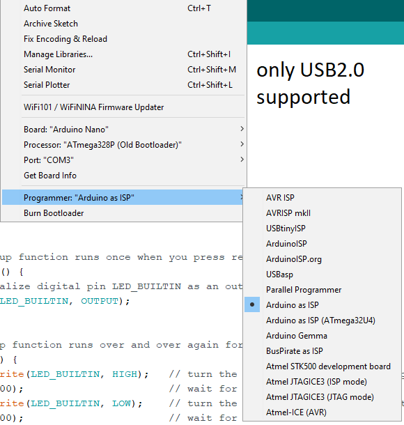
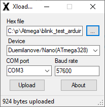
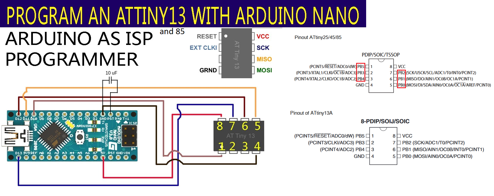
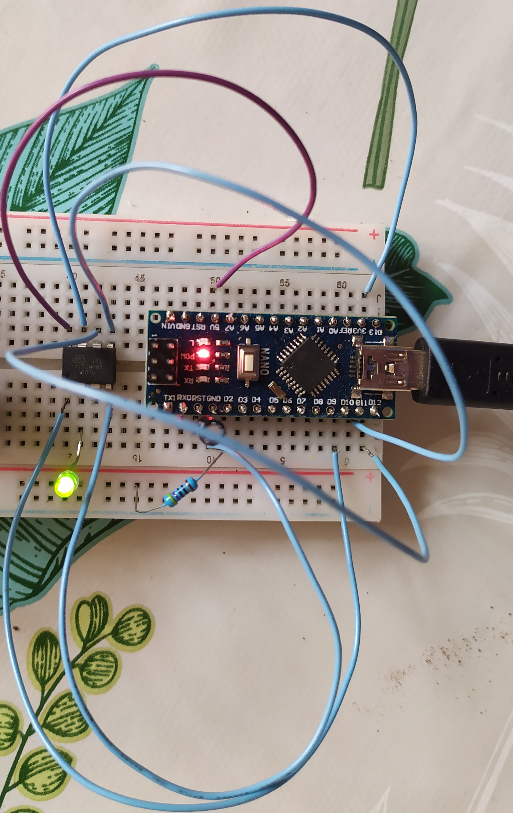

# ATTiny Programming with Arduino Nano
## Prerequisites
Arduino Nano probably contains an [Atmega328P](https://ww1.microchip.com/downloads/en/DeviceDoc/Atmel-7810-Automotive-Microcontrollers-ATmega328P_Datasheet.pdf) micro-controller which is flash-able through [CH340C](https://www.mpja.com/download/35227cpdata.pdf) USB2.0 to serial chip with a specific board I/O layout.  
Important to notice that the support USB version is 2.0!

## Content
This documentation is about setting up an Arduino Nano with as an In-System Programmer or ISP for [ATTiny85](https://ww1.microchip.com/downloads/en/devicedoc/atmel-2586-avr-8-bit-microcontroller-attiny25-attiny45-attiny85_datasheet.pdf) ([ATTiny13](https://ww1.microchip.com/downloads/en/DeviceDoc/ATtiny13A-Data-Sheet-DS40002307A.pdf) is not tested yet).

# Windows
## 1. Make ISP from Nano
### 1.1. With Arduino IDE
1. File -> Examples -> 11.ArduinoISP -> Click on "ArduinoISP" to load example project
2. Plug in your Arduino Nano into an USB2.0 port.
3. Set "Board", "Processor", "Port" and "Programmer" according to your needs.  
E.g.: My working options are:  
  
4. Hit "Upload"

### 1.2. Or upload old ISP with XLoader
1. **Flash [hexes/nano_isp.hex](./hexes/nano_isp.hex) onto your Nano and turn your Arduino Nano into an ISP**
   1. Downloading [XLoader](https://github.com/binaryupdates/xLoader) and by setting up the following options:  
      

    2. "Hex file" field will be `nano_isp.hex` in `hexes` in project root.  
    3. Chose the correct **COM port** and make sure that this port, used by Arduino, is **type of 2.0**)  
    4. If flashing does not work, find another cable or Arduino Nano or choose another COM port for your board.

## 2. **Set up AvrDude**  
   1. [Download AVRDude releases](https://github.com/mariusgreuel/avrdude/releases)  
   Find the AvrDude version which aligns with your platform and system architecture.  
    E.g.: [Download AVRDude for Windows 10 + Intel CPU](https://github.com/mariusgreuel/avrdude/releases/download/v7.1-windows/avrdude-v7.1-windows-windows-x64.zip).  
    AVRDude repos:  
        - [Windows](https://github.com/mariusgreuel/avrdude)
        - ([Linux](https://github.com/avrdudes/avrdude))
   2. Create a `AvrDude` folder at `C:\Users\`< **USERNAME** > and a `bin` folder in `AvrDude`.
   3. Unzip the downloaded `.zip` file in the `bin` folder.
   4. Add "`C:\Users\`< **USERNAME** >`\AvrDude\bin`" to your environmental variable called "`Path`".
   5. Open a brand-new CommandPrompt and check if it recognizes the command:  
        ```bash
        avrdude
        ```
        If yes, you can continue with the next step, if not, double check your environmental variable.

3. Assembly the flashing setup accordingly:
      
4. Navigate to the root folder of this project in cmd and run the following command by replacing < **USERNAME** > to yours:
   ```bash
    avrdude -C C:/Users/< USERNAME >/AvrDude/bin/avrdude.conf -v -p attiny85 -c stk500v1 -P COM3 -b 19200 -U flash:w:hexes/blink_attiny85.hex:i
   ```
5. It must blink now!

## 3. Build & Flash blinker.c
1. [install avr-gcc](https://blog.zakkemble.net/avr-gcc-builds/) (By installing [Arduino IDE](https://www.arduino.cc/en/software) or [AVR Studio](https://tinusaur.com/guides/avr-gcc-toolchain/) you can also get it)
2. Add bin folder of AVR GCC to you environmental variable called "`Path`"
3. `cd` to `projects` and to `build`
4. Run:
    ```bash
    .\build_flash.bat
    ```
    OR
    ```bash
    avr-gcc -mmcu=attiny85 -o blinker.elf ../blinker.c
    avr-objcopy -j .text -j .data -O ihex blinker.elf blinker.hex
    avrdude -C C:/Users/< USERNAME >/AvrDude/bin/avrdude.conf -v -p attiny85 -c stk500v1 -P COM3 -b 19200 -U flash:w:blinker.hex:i
    ```

# Ubuntu
## 1. Creating a programmer from your Arduino Nano

```bash
sudo apt install arduino
sudo usermod -a -G dialout <USERNAME>
reboot
arduino
```

1. **Go to:** File -> Examples -> ArduinoISP  
2. **Choose the followings in "Tools" menu:**  
Board: "Arduino Nano"  
Processor: "Atmega328P (Old Bootloader)"  (Old Bootloader if you have an old board)
Port: E.g.: /dev/ttyUSB0  
Programmer: "AVRISP mkll"  
3. **Hit upload!**

## 2. Build your code
I did not took the time to set up avr-gcc as ArduinoIDE did on Ubuntu.  
I was using avr-gcc set up by ArduinoIDE:  
Navigate to your build directory (`FlashATTinyByNano/projects/01_blinker/build`) and:
```bash
/snap/arduino/85/hardware/tools/avr/bin/avr-g++ -mmcu=attiny85 -o blinker.elf ../blinker.c
avr-objcopy -j .text -j .data -O ihex blinker.elf blinker.hex
```

## 3. Upload your built code
```bash
sudo apt-get install avrdude
# E.g.: 
avrdude -C /snap/arduino/85/hardware/tools/avr/etc/avrdude.conf -v -p attiny85 -c stk500v1 -P /dev/ttyUSB0 -b 19200 -U flash:w:blink_attiny85.hex:i 
```

  